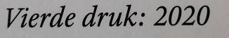

# Instructies

## Bibliotheek

In een boek staat meestal vermeld in welk jaar het gedrukt is. Een voorbeeld zie je hieronder.

Vul de methode `int geefJaarVanDruk(String drukVermelding)` aan zodat deze het jaar teruggeeft waarin het boek gedrukt werd. Volgende parameters worden meegegeven:
- `drukVermelding` : een `String` met de drukvermelding. Bijv. 'Vierde druk: 2020' Je mag er van uitgaan dat de laatste 4 karakters van de string het jaar bevatten.

Vul de code op de plaats van de vraagtekens in.

 

_Ga met je muis over de tips om ze te bekijken. Tijdens een toets of het examen krijg je geen tips, dus weersta aan de verleiding om alle tips te openen zonder zelf eerst eens te proberen._

 

Met de functie <code>substring</code> haal je een deel uit een <code>String</code>.

De functie <code>length</code> geeft je de lengte van de string terug.

Je zult een <code>String</code> moeten omzetten naar een getal. Kijk in je boek hoe dit moet.

