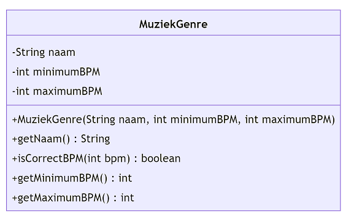

# Instructies

## Spotify

In deze reeks oefeningen zullen we enkele klassen ontwerpen en programmeren die gaan over liedjes, uitvoerders en muziekgenres zoals je die kent uit een muziekapp zoals Spotify, Apple Music, Google Music, enz ...

We beginnen met de klasse ´MuziekGenre´. Het klassendiagram vind je hieronder:

De code die je krijgt bevat nog geen functionaliteit betreffende de <i>[Beats Per Minute (BPM)](https://nl.wikipedia.org/wiki/Beats_per_minute)</i> (Klik op de link als je dit niet kent). Een muziekgenre wordt onder andere gekenmerkd door onder het aantal BPM. Dit zie je in de tabel hieronder:

| MuziekGenre | Minimum BPM | Maximum BPM |
|-------------|-------------|-------------|
| Reggae | 60 | 90 |
| Pop | 100 | 130 |
| Meta | 100 | 160 |

Vul de code aan zodat deze overeenkomt met de het klassendiagrm hierboven.

 

_Ga met je muis over de tips om ze te bekijken. Tijdens een toets of het examen krijg je geen tips, dus weersta aan de verleiding om alle tips te openen zonder zelf eerst eens te proberen._

 

De functie <code>IsCorrectBPM</code> moet <code>true</code> teruggeven indien de meegegeven bpm binnen de minimum en maximum BPM van het muziekgenre ligt (grenzen inbegrepen).

De constructor moet dus uitgebreid worden.

