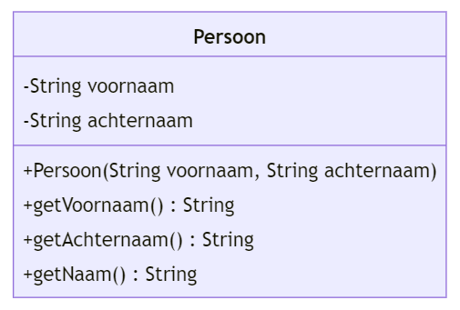

# Instructies

## Spotify

In deze reeks oefeningen zullen we enkele klassen ontwerpen en programmeren die gaan over liedjes, uitvoerders en muziekgenres zoals je die kent uit een muziekapp zoals Spotify, Apple Music, Google Music, enz ...

Schrijf een klasse die overeenkomt met onderstaand klassendiagram. We zullen deze klasse in een volgende oefening gebruiken.

Vul de code aan zodat deze overeenkomt met de het klassendiagram hierboven. De functie `getNaam()` met de naam teruggeven in de vorm `"<voornaam><spatie><achternaam>"` (zonder quotes). Dus bijv. `"Miley Cyrus"`.

 

_Ga met je muis over de tips om ze te bekijken. Tijdens een toets of het examen krijg je geen tips, dus weersta aan de verleiding om alle tips te openen zonder zelf eerst eens te proberen._

 

Geen tips :-(

Of toch ;-) 
Je dient de klasse helemaal zelf te schrijven. 
Let op dat je exact dezelfde namen gebruikt als in het klassendiagram. 
Dus ook qua hoofdletters en kleine letters.

