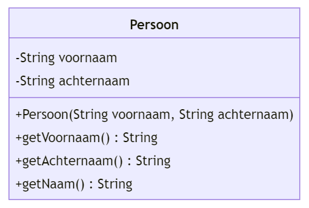

# Instructies

## Lied

In deze reeks oefeningen zullen we enkele klassen ontwerpen en programmeren die gaan over liedjes, uitvoerders en muziekgenres zoals je die kent uit een muziekapp zoals Spotify, Apple Music, Google Music, enz ...

Vul de klasse `Lied` aan op de plaats van de vraagtekens. De functie `getInfo()` moet een String teruggeven in de vorm `"<naam lied>, uitvoerder <naam uitvoerder>, componist <naam componist>"`.

Je gebruikt de klasse `Persoon` uit de vorige oefening. Deze hoef je niet nog eens te schrijven. Hieronder nog eens het klassendiagram.

 
_Ga met je muis over de tips om ze te bekijken. Tijdens een toets of het examen krijg je geen tips, dus weersta aan de verleiding om alle tips te openen zonder zelf eerst eens te proberen._

 

In de method `setUitvoerderViaNaam` zal je een nieuw object van de klasse <code>Persoon</code> moeten maken.

Gebruik hiervoor het sleutelwoord <code>new</code> en de constructor. Kijk in je boek als je niet meer juist weet hoe dit moet.

De naam van een persoon krijg je terug via de functie <code>getNaam()</code>.

