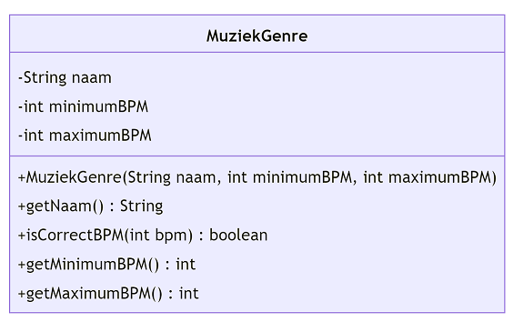

# Instructies

## Herhaling

Test

Test

 

_Ga met je muis over de tips om ze te bekijken. Tijdens een toets of het examen krijg je geen tips, dus weersta aan de verleiding om alle tips te openen zonder zelf eerst eens te proberen._

 

De functie <code>IsCorrectBPM</code> moet <code>true</code> teruggeven indien de meegegeven bpm binnen de minimum en maximum BPM van het muziekgenre ligt (grenzen inbegrepen).

De constructor moet dus uitgebreid worden.

