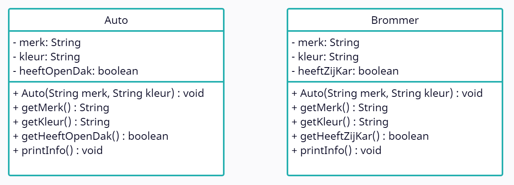

# Instructies

## Auto, Brommer en Voertuig

We gaan een programma herwerken zodat we gebruik maken van overerving. Het programma bevat twee klassen: Auto en Brommer. In onderstaand klassendiagram zie je de definitie van de twee klassen.

We zien dat de twee klassen gelijkaardige velden hebben.

**Je opdracht:**
 
Maak een nieuwe klasse genaamd 'Voertuig' die de gemeenschappelijke velden en methoden bevat van de klassen Auto en Brommer. Deze klasse zal in een volgende oefening de superklasse worden van Auto en Brommer. Implementeer de accessormethoden en de constructor.

 

_Ga met je muis over de tips om ze te bekijken. Tijdens een toets of het examen krijg je geen tips, dus weersta aan de verleiding om alle tips te openen zonder zelf eerst eens te proberen._

 

Bekijk welke velden gemeenschappelijk zijn, en definieer deze in de klasse 'Voertuig'

Zijn de constructors van Auto en Brommer gelijkaardig?

Vergeet niet de gemeenschappelijke methoden.

