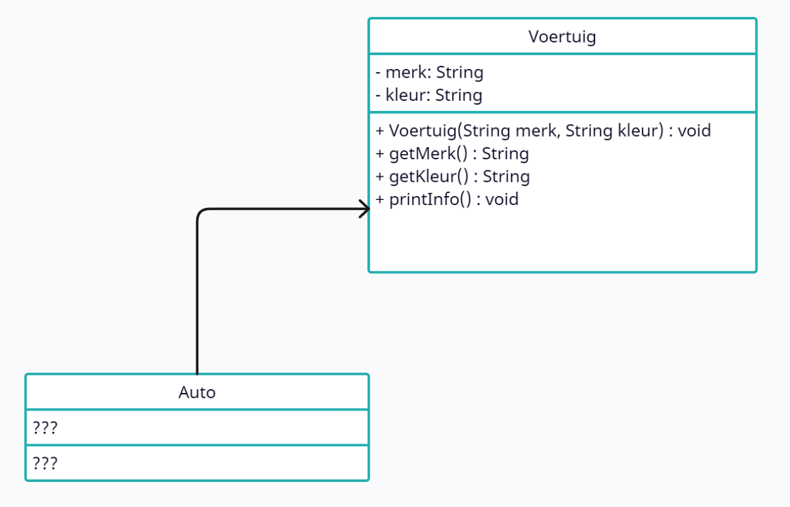

# Instructies

## Auto, Brommer en Voertuig

**Je opdracht:**
 
Je krijgt de oorspronkelijke code van de klasse 'Auto'. Pas deze aan zodat 'Auto' overerft van 'Voertuig' zoals te zien in het klasdiagram hierboven.

Denk na over welke velden en methoden er nog nodig zijn in de klasse 'Auto'. En wat moet je doen in de constructor?
 

_Ga met je muis over de tips om ze te bekijken. Tijdens een toets of het examen krijg je geen tips, dus weersta aan de verleiding om alle tips te openen zonder zelf eerst eens te proberen._

 

Wat moet je in de header van de klasse om deze te laten overerven van 'Voertuig'?

Moeten we alle velden nog behouden? En de methoden?

In de constructor van 'Auto' moet je iets "speciaal" doen zodat de velden van 'Voertuig' geïnitialiseerd worden.

